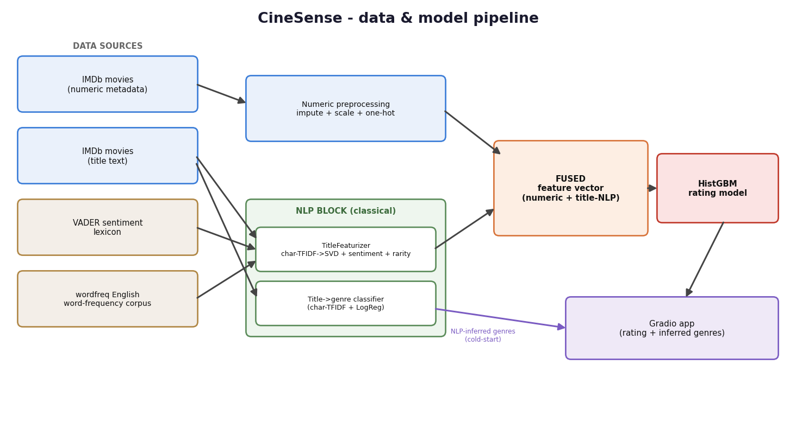
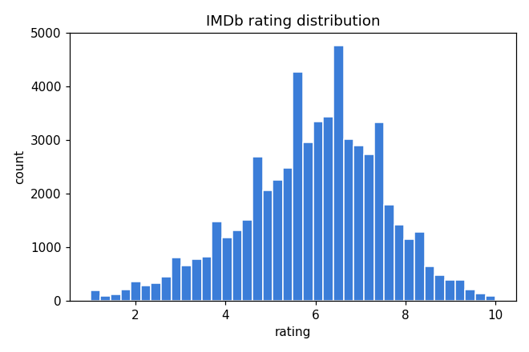
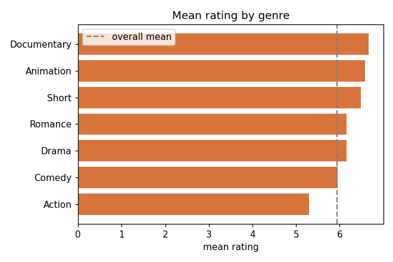
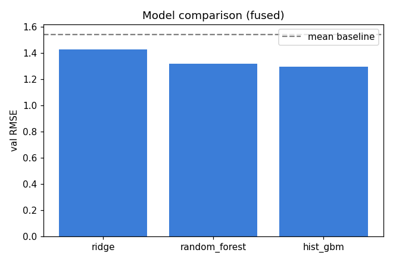
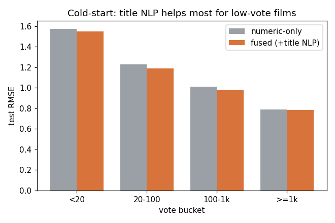
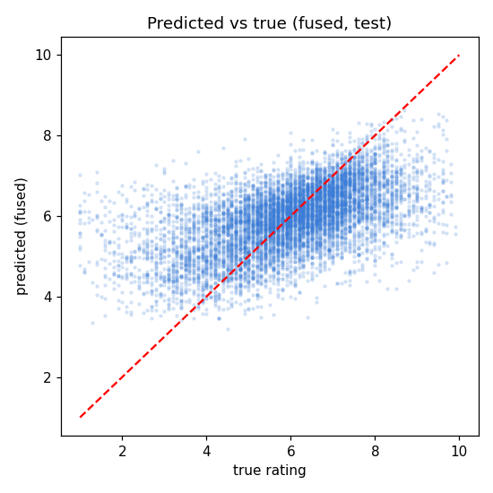
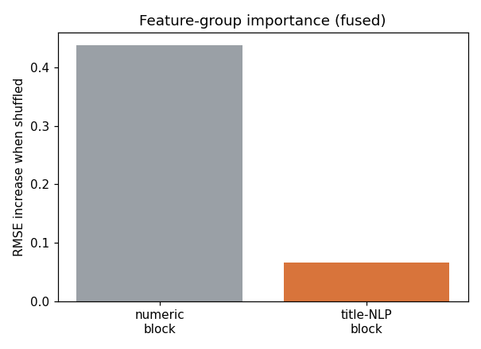
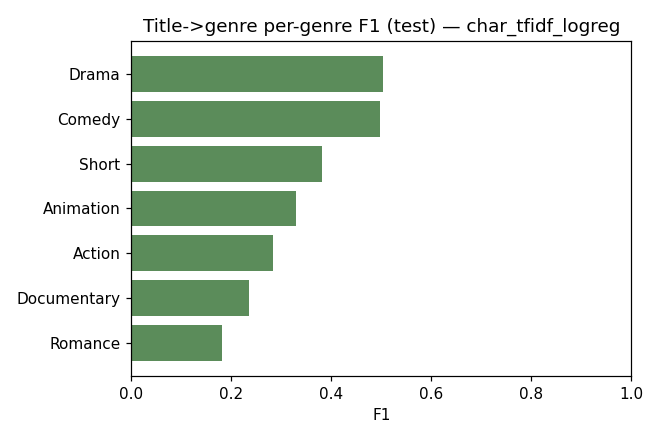
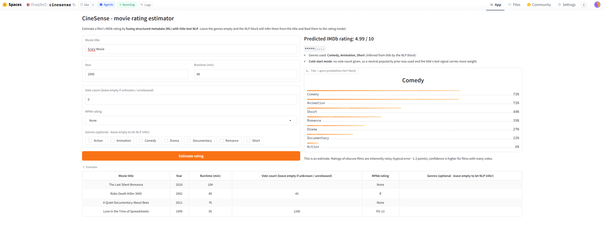
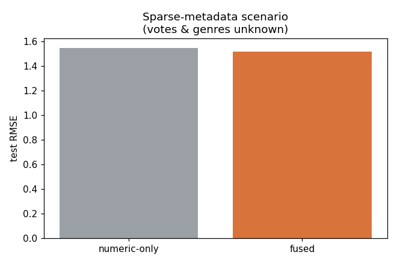

# AI Applications Project Documentation

## Documentation Hint

Code references point at files in this repository, e.g.
[`src/train_numeric.py`](../src/train_numeric.py) and specific lines such as
[`src/fused_model.py`, lines 30-41](../src/fused_model.py#L30-L41).

## Project Metadata

- Project title: **CineSense - Cold-Start Movie Rating Estimation by Fusing Metadata (ML) with Title NLP**
- Student: Besfort Thaqi
- GitHub repository URL: https://github.com/thaqibe2/cinesense
- Deployment URL: https://huggingface.co/spaces/thaqibe2/cinesense
- Submission date: 2026-06-07

### Mandatory Setup Checks

- [x] At least 2 blocks selected (ML Numeric + NLP)
- [x] Multiple and different data sources used (IMDb numeric, IMDb title text, VADER lexicon, wordfreq corpus)
- [x] Deployment URL provided (https://huggingface.co/spaces/thaqibe2/cinesense)
- [x] Required GitHub users added to repository (`jasminh`, `bkuehnis`)

## Selected AI Blocks

- [x] ML Numeric Data
- [x] NLP
- [ ] Computer Vision

Primary blocks used for core solution (choose 2):
- Primary block 1: **ML Numeric Data** (rating regression)
- Primary block 2: **NLP** (title text -> genre + style/rarity features; two approaches: classical models and an optional OpenAI LLM)

No third block is used; effort is concentrated on integrating the two selected blocks well.

---

## 1. Project Foundation (Short)

### 1.1 Problem Definition
- Problem statement: IMDb ratings are easy to read off for popular films but hard to anticipate for obscure or not-yet-released ones, where metadata (especially vote counts) is sparse or missing. Can we estimate a film's rating from minimal information, using the *title text* as an extra signal?
- Goal: predict a film's IMDb rating (1-10) and quantify whether/when NLP features extracted from the title improve a metadata-only model.
- Success criteria: (a) the fused model beats both a mean baseline and a numeric-only model on held-out RMSE; (b) a clear, evaluated answer to *when* the title helps; (c) a working deployed app that uses both blocks at inference.

### 1.2 Integration Logic
- How the selected blocks interact: the NLP block converts a raw title into (i) a multi-label genre probability vector and (ii) a dense `TitleFeaturizer` vector (char-TFIDF -> SVD latent dims + VADER sentiment + word-rarity + style stats). These NLP outputs become **input features** to the ML numeric regressor. The blocks share data (the title), and one block's output is another's input (NLP -> ML), covering the "derived features" and "model outputs" interaction modes.
- Data and output flow between blocks:



The fusion logic is implemented in [`src/fused_model.py`, lines 30-41](../src/fused_model.py#L30-L41): `predict()` builds the numeric matrix and the title-NLP matrix and concatenates them for a single regressor. At inference the app also calls the title->genre classifier to fill genres when the user provides none.

---

## 2. Block Documentation

### 2A. ML Numeric Data (selected)

#### 2A.1 Data Source(s)

| Entry | Source name or link | Type | Size | Role in this block |
| --- | --- | --- | --- | --- |
| 1 | IMDb `movies` table via `pydataset` (the ggplot2 movies dataset) | Structured / numeric | 58,733 rows after cleaning, 14 numeric features | Primary training table for rating regression |
| 2 | Derived numeric features (log_votes, log_budget, decade, n_genres) | Engineered numeric | same rows | Feature engineering on source 1 |
| 3 | VADER sentiment lexicon (`vaderSentiment`) via the NLP TitleFeaturizer | Lexicon -> numeric features | ~7.5k entries | Title-tone features consumed by the regressor |
| 4 | English word-frequency corpus (`wordfreq`) via the NLP TitleFeaturizer | Frequency corpus -> numeric features | corpus of millions of words | Title word-rarity features consumed by the regressor |

#### 2A.2 Preprocessing and Features
- Cleaning steps: dropped the leakage columns `r1..r10` (per-score vote percentages that decompose the target); removed runtimes <=0 or >600 min, years outside 1900-2010, and films with <5 votes; dropped empty titles. See [`src/data_prep.py`](../src/data_prep.py) (`clean`).
- Preprocessing steps: median imputation + standard scaling for numeric features; one-hot encoding for `mpaa` (missing -> "None"). See `build_features` in [`src/train_numeric.py`](../src/train_numeric.py).
- Feature engineering and selection: `log_votes = log1p(votes)`, `log_budget`, `has_budget` indicator (budget is 91% missing), `decade`, `n_genres`, plus 7 binary genre flags and light title stats. See `engineer` in [`src/data_prep.py`](../src/data_prep.py).

**EDA key findings** (see `src/eda.py` and figures below):
- The target is roughly bell-shaped around mean 5.93, std 1.55 (figure 01).
- All numeric features correlate only weakly with rating: log_votes 0.074, length -0.035, year -0.072 (figure 05) - so metadata alone is a weak predictor, leaving room for the title signal.
- Documentaries are highest-rated on average (6.66), Action lowest (5.29) (figure 03).
- **Anomalies/risks:** 39.6% of films have <20 votes and their rating std (1.74) is much higher than overall (1.55) - a noisy, hard-to-predict cold-start regime; `budget` (91% missing) and `mpaa` (91.6% missing) are mostly absent and handled with indicators / a "None" category rather than dropped rows.




#### 2A.3 Model Selection
- Models tested: Ridge regression, RandomForestRegressor, HistGradientBoostingRegressor.
- Why these models were chosen: Ridge as a fast linear baseline; RandomForest and HistGBM to capture non-linear interactions among metadata and the dense title features. HistGBM additionally handles missing `log_budget` natively.

#### 2A.4 Model Comparison and Iterations
| Iteration | Objective | Key changes | Models used | Main metric | Change vs previous |
| --- | --- | --- | --- | --- | --- |
| 1 | Establish floor | Predict the training mean | baseline | Test RMSE 1.543 | - |
| 2 | Compare model families (fused features) | Ridge vs RF vs HistGBM | 3 models | Val RMSE 1.430 / 1.319 / **1.297** | HistGBM best (-9.3% vs Ridge) |
| 3 | Quantify block contribution | Ablation numeric vs text vs fused (best model) | HistGBM | Test RMSE 1.318 / 1.517 / **1.290** | Fused beats numeric-only by 2.2% |



#### 2A.5 Evaluation and Error Analysis
- Metrics used: RMSE (primary), MAE, R2 on a held-out 15% test split (70/15/15 stratified by rating bucket, seed 42).
- Final results: fused HistGBM Test RMSE **1.290**, MAE **0.969**, R2 **0.301** (vs mean baseline RMSE 1.543). See `reports/numeric_metrics.json`.
- Error patterns and likely causes: the eight largest residuals are all films with 5-15 votes whose true ratings are extreme (1.0-1.4) but predicted ~6.2-7.3 (`reports/eval_metrics.json` -> `largest_residuals`). Cause: with a handful of votes a single rater drives the score - irreducible noise. RMSE by vote bucket confirms this: 1.55 (<20 votes) down to 0.79 (>=1k votes).




#### 2A.6 Integration with Other Block(s)
- Inputs received from other block(s): the dense `TitleFeaturizer` vector (20 SVD dims + 3 VADER scores + 2 word-rarity + 4 style stats = 29 features) from the NLP block; optionally NLP-inferred genre flags at inference.
- Outputs provided to other block(s): the predicted rating consumed by the app's user-facing layer; the numeric ablation defines the experiment the NLP block is evaluated within. Group permutation importance: shuffling the title-NLP feature block raises test RMSE by 0.066 (the numeric block by 0.438) - title-NLP carries real, secondary signal.



### 2B. NLP (selected)

#### 2B.1 Data Source(s)

| Entry | Source name or link | Type | Size | Role in this block |
| --- | --- | --- | --- | --- |
| 1 | IMDb `movies` `title` column (pydataset) | Free text | 58,733 titles, mean ~16 chars | Input text for genre classification and featurization |
| 2 | IMDb `movies` genre flags (Action..Short) | Binary labels | 7 labels x 58,733 | Supervision targets for the title->genre classifier |
| 3 | VADER sentiment lexicon (`vaderSentiment`) | Lexicon | ~7.5k tokens | Title sentiment features (compound/pos/neg) |
| 4 | English word-frequency corpus (`wordfreq`) | Frequency corpus | millions of words | Title word-rarity features (mean Zipf, OOV fraction) |

#### 2B.2 Preprocessing and Prompt Design
- Text preprocessing: lowercasing; character-level `char_wb` n-grams (3-5) and word n-grams (1-2) via TF-IDF; `min_df=5` to drop rare noise. Char n-grams are robust to the many proper nouns, foreign romanizations and sequel numbers in titles. See `build_candidates` in [`src/train_nlp.py`](../src/train_nlp.py) and [`src/nlp_features.py`](../src/nlp_features.py).
- Prompt design or retrieval setup: N/A - classical NLP (no LLM/RAG). The design decision is the featurization: char-TFIDF -> TruncatedSVD(20) for latent style + VADER sentiment + wordfreq rarity + style flags.

#### 2B.3 Approach Selection
Two NLP approaches are used and compared:
- **Classical NLP** (core, offline): multi-label (OneVsRest) classification of genres from the title, plus an unsupervised title featurizer for fusion. Kept as the reproducible prediction engine.
- **LLM / prompt engineering** (OpenAI, optional): a prompt-engineered layer (see [`src/llm.py`](../src/llm.py)) that (a) extracts structured features from a free-text movie description and (b) writes a grounded explanation of the prediction. JSON-mode prompts with an allowed-genre whitelist and post-validation guard against hallucination; every call has a fallback so the app runs without a key.
- Rationale: the classical model guarantees reproducibility and isolates the integration question; the LLM adds world knowledge, a natural-language interface, and an explanation layer that pure feature models cannot provide.

#### 2B.4 Comparison and Iterations
| Iteration | Objective | Key changes | Model or prompt setup | Main metric or qualitative check | Change vs previous |
| --- | --- | --- | --- | --- | --- |
| 1 | Word-level baseline | word TF-IDF (1-2) + OVR LogReg | classical | Val micro-F1 0.374 | - |
| 2 | Better tokenisation | char_wb TF-IDF (3-5) + OVR LogReg | classical | Val micro-F1 **0.393** | +0.019 (best) |
| 3 | Generative-model baseline | CountVectorizer + MultinomialNB | classical | Val micro-F1 0.279 | -0.114 (worse) |
| 4 | LLM approach | OpenAI `gpt-4o-mini`, title-only prompt | LLM | micro/macro-F1 in `reports/llm_comparison.md` | classical vs LLM on a 60-title sample |



The classical-vs-LLM comparison is produced by [`src/llm_compare.py`](../src/llm_compare.py) on a small capped sample (default 60 titles, < $0.01) and written to [`reports/llm_comparison.md`](../reports/llm_comparison.md). Both approaches hit the same ceiling - a bare title is weak genre evidence - but the LLM leverages knowledge of real titles while the classical model only sees character patterns.

#### 2B.5 Evaluation and Error Analysis
- Evaluation strategy: micro/macro-F1 on val for model choice; final per-genre F1 on test; plus a qualitative review of predictions. The featurizer is evaluated indirectly via the numeric ablation and permutation importance.
- Results: best model (char-TFIDF + LogReg) test micro-F1 **0.400**, macro-F1 **0.345**. Per-genre F1: Drama 0.50 and Comedy 0.50 (frequent, lexically distinctive) vs Romance 0.18 and Documentary 0.24.
- Representative outputs and failure cases: full table in [`reports/nlp_qualitative.md`](../reports/nlp_qualitative.md). Examples: "A Quiet Documentary About Bees" -> Documentary 0.95; "Robo Death Killer 3000" -> Action 0.97; "Love Actually Forever" -> Romance 0.90. Failures occur on short / genre-neutral titles (proper names, abstract single words), which are underdetermined.
- Error patterns and likely causes: titles are short and frequently genre-neutral, so genre is often underdetermined; rare genres suffer class imbalance despite `class_weight="balanced"`.

#### 2B.6 Integration with Other Block(s)
- Inputs received from other block(s): none directly; the NLP block consumes raw titles and genre labels from the shared dataset plus two external lexicons/corpora.
- Outputs provided to other block(s): (1) the `TitleFeaturizer` vector used as fused features by the ML regressor; (2) inferred genre probabilities used by the app to fill genres when the user provides none; (3) **LLM-extracted structured features** - when the user types a free-text description, the LLM returns a canonical title, genres and year/runtime that become inputs to the ML model (free text -> LLM -> ML); (4) a **grounded LLM explanation** of each prediction, built only from the model's own outputs (rating, genre probabilities, cold-start flag) to avoid hallucination.

---

## 3. Deployment

- Deployment URL: https://huggingface.co/spaces/thaqibe2/cinesense
- Main user flow: the user enters a movie title and any known metadata (year, runtime, optional vote count, MPAA, optional genres) - or a free-text description - and clicks "Estimate rating". If genres are left empty, the NLP block infers them from the title; if the vote count is empty the app enters cold-start mode (neutral popularity prior, title signal weighted more). The app returns the predicted rating, the genres used, the title->genre probabilities, and (when an OpenAI key is set) an AI-written explanation. See [`app.py`](../app.py).
- LLM configuration: the app reads `OPENAI_API_KEY` from the environment. On the Space, set it under **Settings -> Variables and secrets**; locally, `export OPENAI_API_KEY=...`. Without it, the app shows "AI explanation: OFF" and falls back to the classical pipeline (no crash).
- Separation of training and inference: training scripts in `src/` produce `models/*.joblib`; `app.py` only loads those artifacts and calls `FusedRatingModel.predict` - it never trains. The LLM is inference-only and never used during training.
- Screenshot or short demo: live screenshot of the running Space (`thaqibe2/cinesense`) below.



---

## 4. Execution Instructions

- Environment setup:
  ```bash
  python -m venv .venv && source .venv/bin/activate
  pip install -r requirements-dev.txt   # full reproduction
  # (the Space itself only needs requirements.txt)
  ```
- Data setup: none to download - the IMDb table ships with `pydataset` and is loaded by `src/data_prep.py`; the cleaned table is written to `data/processed.csv` and committed for full offline reproducibility.
- Training command(s):
  ```bash
  python run_all.py        # data_prep -> eda -> train_nlp -> train_numeric -> evaluate
  # or individually:
  python src/data_prep.py && python src/train_nlp.py && python src/train_numeric.py && python src/evaluate.py
  ```
- Inference/run command(s):
  ```bash
  python app.py            # http://localhost:7860
  # optional LLM features + comparison (needs an OpenAI key):
  export OPENAI_API_KEY=sk-...      # set OPENAI_API_KEY=... on Windows
  python src/llm_compare.py 60      # classical-vs-LLM study -> reports/llm_comparison.md
  ```
- Reproducibility notes: global seed 42 (splits, SVD, models). Versions pinned in `requirements.txt` (scikit-learn 1.7.2, numpy 2.2.6, gradio 6.15.2, wordfreq 3.1.1, openai 2.41.0). The classical pipeline runs in ~1 minute on 2 CPU cores with no GPU and no network. The LLM layer is optional and only calls the OpenAI API at inference (one short call per request); default model `gpt-4o-mini` (override with `OPENAI_MODEL`).

---

## 5. Optional Bonus Evidence

- [ ] Third selected block implemented with strong quality
- [x] More than two data sources used with clear added value (IMDb numeric, IMDb title text, VADER lexicon, wordfreq corpus)
- [x] A core section is done exceptionally well (rigorous numeric/text/fused ablation + per-vote-bucket and sparse-metadata analyses)
- [x] Extended evaluation (feature-group permutation importance, sparse-metadata scenario, residual analysis)
- [x] Ethics, bias, or fairness analysis (see below)
- [x] Creative or exceptional use case (title-text fusion for cold-start rating + LLM free-text feature extraction)
- [x] Two NLP approaches implemented and compared (classical char-TFIDF/LogReg **and** an OpenAI LLM with prompt engineering)

Evidence for selected bonus items:
- **LLM integration & prompt engineering**: an optional OpenAI layer ([`src/llm.py`](../src/llm.py)) extracts structured features from a free-text description (free text -> LLM -> ML inputs) and writes grounded explanations. Hallucination is mitigated by JSON-mode prompts, an allowed-genre whitelist, output validation, and explanations restricted to the model's own outputs; cost is bounded (one short call per request, default `gpt-4o-mini`). A capped classical-vs-LLM study is in `reports/llm_comparison.md`.
- **Fairness / bias**: RMSE is similar for multi-word titles (1.282) and slightly worse for single-word titles (1.327), so the model is mildly less reliable when there is less text to read. The corpus contains **zero non-Latin-script titles** - foreign films appear romanized - so the model is entirely untested on non-Latin scripts and should not be trusted on them (`reports/eval_metrics.json` -> `fairness_by_title_type`). Genre F1 is far lower for under-represented genres (Romance 0.18), a class-imbalance bias to flag before any real use.
- **Extended evaluation**: the sparse-metadata scenario (votes & genres blanked to mimic an unreleased film) shows fusion improving RMSE by **+1.95%** over numeric-only, confirming the title carries the most relative value exactly when metadata is missing.


